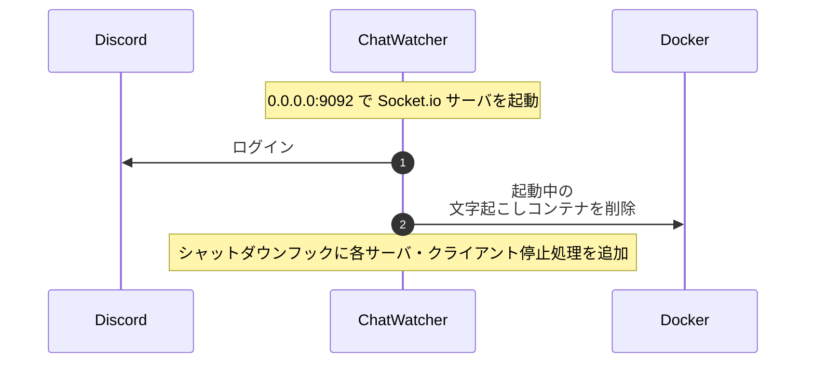
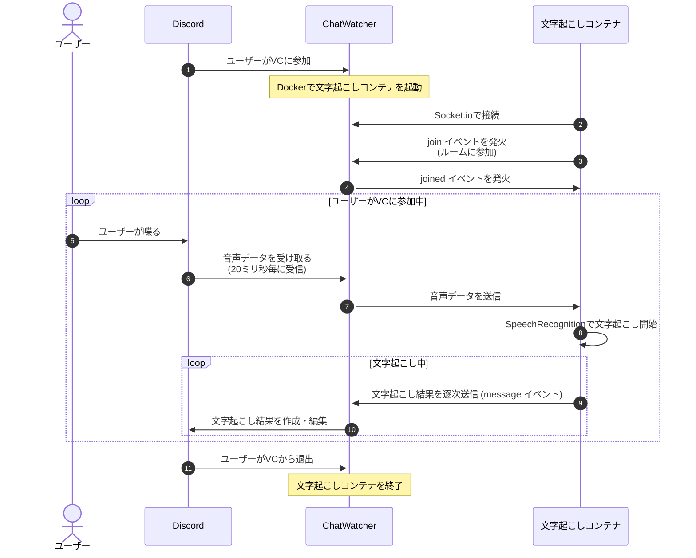

# ChatWatcher

VC の音声を聞いて文字起こしする。(Voice)ChatWatcher

Web Speech API の [SpeechRecognition](https://developer.mozilla.org/ja/docs/Web/API/SpeechRecognition) を使用したリアルタイム文字起こし

- `make`: 起動
- `make stop`: 停止
- `make attach`: コンテナに入る
- `make logs`: ログリアルタイム表示

## コマンド

スラッシュコマンドにて実装。すべてのコマンドは `/chatwatcher` の下に作成される

- `/chatwatcher add-server`: コマンドを実行したサーバを ChatWatcher の対象サーバとして登録する
- `/chatwatcher remove-server`: コマンドを実行したサーバを ChatWatcher の対象サーバから削除する
- `/chatwatcher summon`: コマンド実行者が参加しているボイスチャンネルに参加する
- `/chatwatcher disconnect`: 参加しているボイスチャンネルから退出する
- `/chatwatcher add-channel [Channel]`: 指定したチャンネル、またはコマンド実行したチャンネルを文字起こし結果送信チャンネルとして登録する
- `/chatwatcher remove-channel [Channnel]`: 指定したチャンネル、またはコマンド実行したチャンネルの文字起こし結果送信チャンネル登録を解除する

## シーケンス図

### 起動

## ユーザーが参加・退出する場合

## その他

- 文字起こしコンテナが残った場合: `docker rm $(docker ps -f "name=chatwatcher-recognizer" -q -a)`
